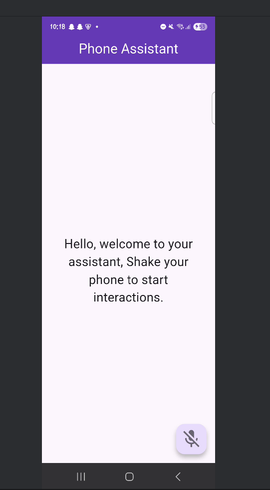
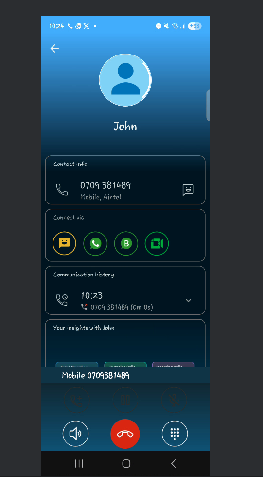
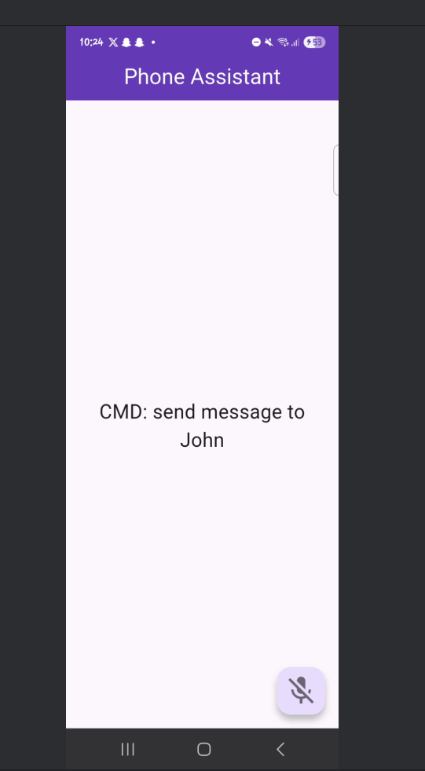
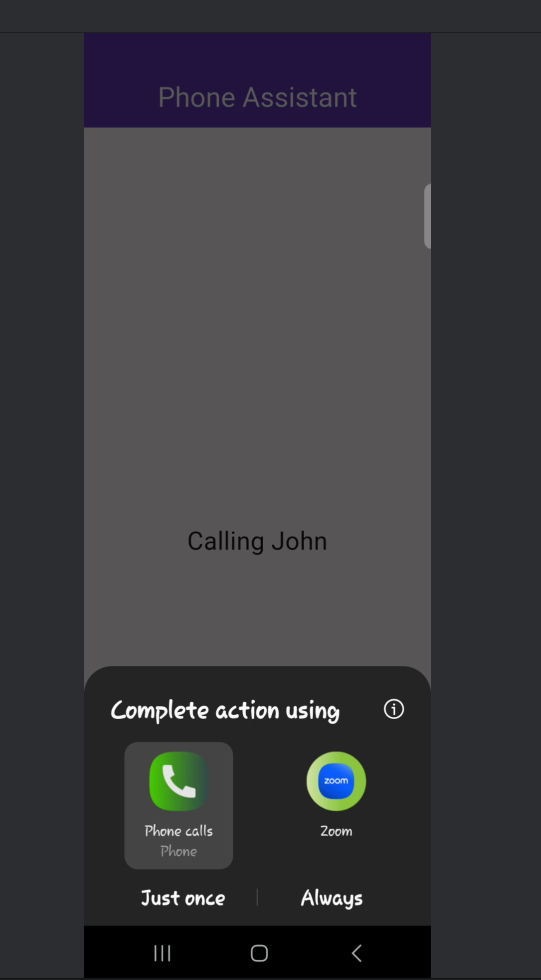

# 📱 Phone Assistant

### 🎙️ Voice-Activated Offline Phone Assistant for the Visually Impaired

---

## 🌍 Overview

The **Phone Assistant** is a mobile application designed to help **visually impaired users** interact with their phones independently using **voice commands and gestures**.

This app removes the need for visual navigation by enabling users to perform essential phone functions through **speech and simple physical interactions**.

---

## 💡 Problem

Many smartphone applications rely heavily on visual interfaces, making it difficult for **blind or visually impaired individuals** to:

* Make phone calls 📞
* Send and read messages 💬
* Navigate through apps 📱

---

## 🚀 Solution

This application provides a **fully offline, voice-controlled assistant** that allows users to:

* 📞 **Make phone calls** using voice commands
* 💬 **Send SMS messages** hands-free
* 📖 **Listen to incoming messages**
* 🎙️ **Interact using speech-to-text and text-to-speech**
* 🤳 **Activate features using gestures (e.g., shake detection)**

---

## ✨ Key Features

* 🔊 Offline Voice Recognition (no internet required)
* 🗣️ Text-to-Speech feedback for accessibility
* 📳 Gesture-based interaction (shake to activate)
* 📇 Smart contact name recognition
* ⚡ Fast and simple command execution

---

## 🛠️ Tech Stack

* 💙 Flutter (Mobile App Development)
* 🎤 Speech-to-Text (STT)
* 🔊 Text-to-Speech (TTS)
* 📱 Native Phone APIs (Calls & SMS)

---

## 🧠 How It Works

1. User **activates the assistant** (voice or gesture)
2. App listens for a command (e.g., *"Call John"*)
3. Command is processed and matched
4. Action is executed (call, SMS, etc.)
5. App provides **audio feedback** to the user

---

## ⚙️ Getting Started

### 1. Clone the repository

```bash
git clone https://github.com/sophienasuna/phone_navigation_assistant.git
cd phone_navigation_assistant
```

### 2. Install dependencies

```bash
flutter pub get
```

### 3. Run the app

```bash
flutter run
```

---

## 📸 Screenshots / Demo

<p align="center">




</p>

---

## 🎯 Target Users

* 👩‍🦯 Blind users
* 👨‍🦯 Visually impaired individuals
* 📱 Anyone who prefers hands-free phone interaction

---

## 🚧 Future Improvements

* 🌐 Multi-language voice support
* 🤖 Smarter AI-based command recognition
* 🔋 Improved offline processing accuracy
* 📍 Integration with navigation and location services

---

## 🤝 Contributing

Contributions, ideas, and feedback are welcome!
Feel free to fork this repo and submit a pull request.

---

## 🙌 Acknowledgements

This project is inspired by the need to create **inclusive technology** that empowers individuals with disabilities.

---

## 👩‍💻 Author

**Sophie Nasuna**
💡 Passionate about building tech solutions that solve real-world problems

---
